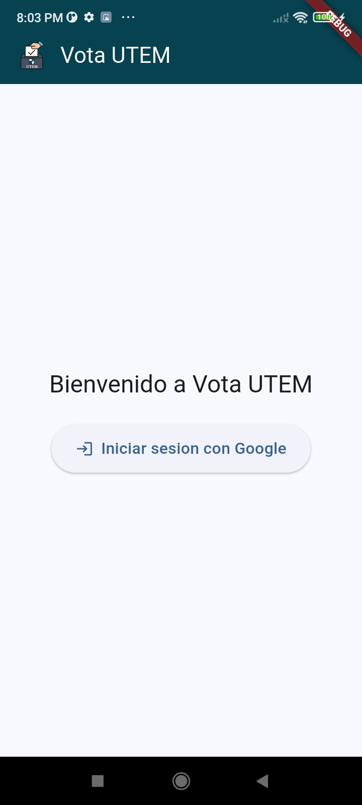
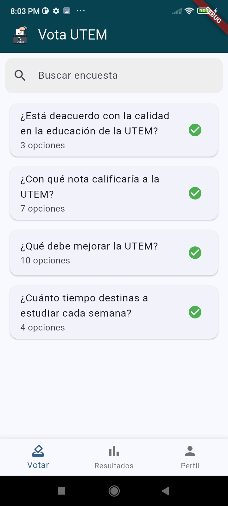
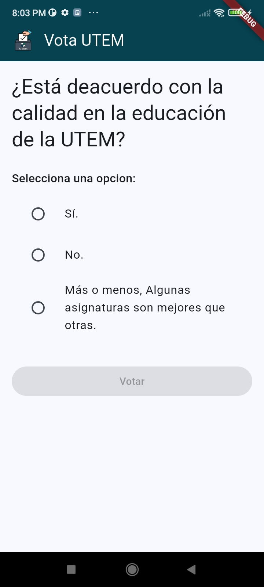
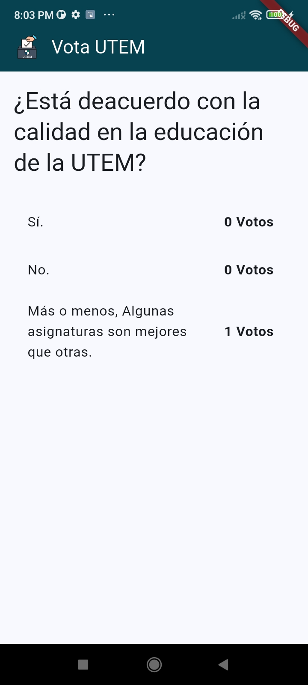
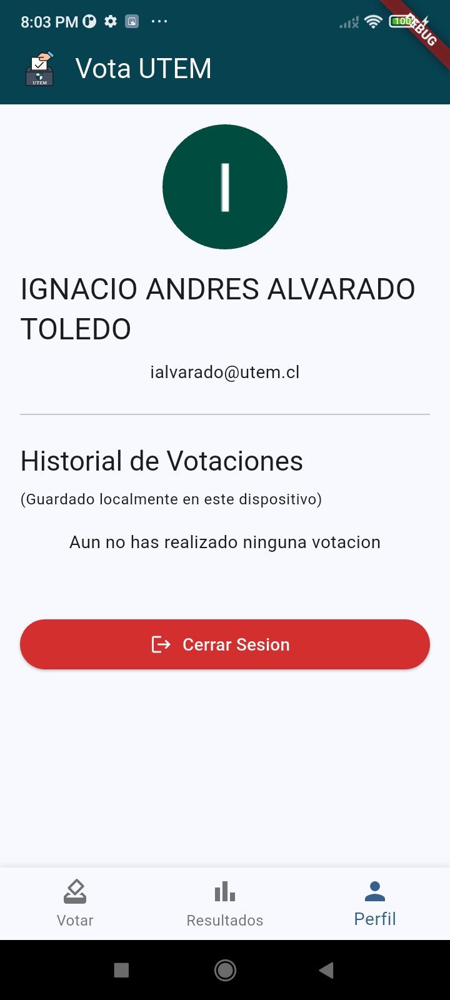

# Proyecto Vota UTEM

**Aplicacion movil de votaciones desarrollada en Flutter como parte de la asignatura Computacion Movil de la UTEM.**

Este proyecto consiste en una aplicacion movil para Android que permite a los usuarios autenticarse, visualizar una lista de encuestas disponibles, votar en ellas y consultar los resultados. La aplicacion consume los servicios expuestos por la API REST del profesor.

---

## Capturas de Pantalla

| Pantalla de Carga | Pantalla de Bienvenida | Lista con Encuestas |
| :---: | :---: | :---: |
|  |  |  |
| **Detalle para Votar** | **Recuento de Votos** | **Perfil de Usuario** |
|  |  |  |

---

## Caracteristicas Implementadas

* **Autenticacion Segura:** Inicio de sesion con Google a traves de Firebase Authentication.
* **Listado de Encuestas:** Visualizacion de encuestas con barra de busqueda en tiempo real.
* **Flujo de Votacion:** Interfaz para seleccionar una opcion y registrar un voto.
* **Consulta de Resultados:** Pantalla dedicada para visualizar los resultados de cada encuesta.
* **Perfil de Usuario:** Muestra de datos del usuario (foto, nombre, correo) y boton de cierre de sesion.
* **Historial de Votaciones Local:** Registro de los votos emitidos, guardados en el dispositivo del usuario.
* **Interfaz Consistente:** Diseno unificado con una barra de navegacion superior e inferior personalizadas.
* **Manejo de Estados:** La aplicacion gestiona visualmente los estados de carga, exito, error y datos vacios.

---

## Tecnologias y Arquitectura

* **Framework:** Flutter
* **Lenguaje:** Dart
* **Arquitectura:** Arquitectura Limpia por capas (Presentacion, Dominio, Datos).
* **Gestion de Estado:** Riverpod
* **Cliente HTTP:** Dio (con interceptores para manejo de autenticacion y errores).
* **Autenticacion:** Firebase Authentication (Google Sign-In).
* **Almacenamiento Local:** SharedPreferences (para el historial de votaciones).
* **Calidad de Codigo:** Pruebas unitarias con Mockito e Integracion Continua con GitHub Actions.

---

## Instrucciones de Instalacion y Uso

### **Requisitos Previos**
* Tener [Flutter SDK](https://docs.flutter.dev/get-started/install) instalado.
* Tener un emulador de Android configurado o un dispositivo fisico conectado.

### **Pasos para la Instalacion**

1.  **Clonar el repositorio:**
    ```bash
    git clone [https://github.com/iAlvaradoUtem/proyecto-votacion-flutter-utem.git](https://github.com/iAlvaradoUtem/proyecto-votacion-flutter-utem.git)
    ```

2.  **Navegar al directorio del proyecto:**
    ```bash
    cd proyecto-votacion-flutter-utem
    ```

3.  **Instalar las dependencias:**
    ```bash
    flutter pub get
    ```

4.  **Ejecutar la aplicacion:**
    ```bash
    flutter run
    ```

---

## Informe Tecnico
El informe tecnico que detalla las decisiones de arquitectura, el mapeo de modelos, el manejo de errores y las medidas de seguridad se encuentra en el archivo `INFORME_TECNICO.md`.